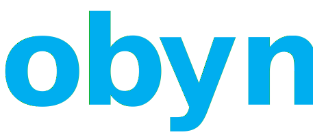

<div id="top"></div>
<!--
*** thanks for checking out the best-readme-template. if you have a suggestion
*** that would make this better, please fork the repo and create a pull request
*** or simply open an issue with the tag "enhancement".
*** don't forget to give the project a star!
*** thanks again! now go create something amazing! :d
-->


<!-- project shields -->
<!--
*** i'm using markdown "reference style" links for readability.
*** reference links are enclosed in brackets [ ] instead of parentheses ( ).
*** see the bottom of this document for the declaration of the reference variables
*** for contributors-url, forks-url, etc. this is an optional, concise syntax you may use.
*** https://www.markdownguide.org/basic-syntax/#reference-style-links
-->
[![contributors][contributors-shield]][contributors-url]
[![forks][forks-shield]][forks-url]
[![stargazers][stars-shield]][stars-url]
[![issues][issues-shield]][issues-url]
[![mit license][license-shield]][license-url]


<!-- project logo -->
<br />
<div align="center">
  <a href="https://github.com/terabyte3/obyn">
    
  </a>

<h3 align="center">obyn</h3>

  <p align="center">
    <em>the spirits of the forest awaken.</em>
    <br />
    <a href="https://github.com/terabyte3/obyn"><strong>🌱 get started »</strong></a>
    <br />
    <br />
    <a href="https://github.com/terabyte3/obyn/issues">🐞 report bug</a>
    ·
    <a href="https://github.com/terabyte3/obyn/issues">request feature</a>
  </p>
</div>


<!-- table of contents -->
<details>
  <summary>🌲 table of contents</summary>
  <ol>
    <li>
      <a href="#about-the-project">🪴 about the project</a>
      <ul>
        <li><a href="#built-with">🍇 built with</a></li>
      </ul>
    </li>
    <li>
      <a href="#getting-started">getting started</a>
      <ul>
        <li><a href="#prerequisites">prerequisites</a></li>
        <li><a href="#installation">installation</a></li>
      </ul>
    </li>
    <li><a href="#usage">usage</a></li>
    <li><a href="#roadmap">roadmap</a></li>
    <li><a href="#contributing">contributing</a></li>
    <li><a href="#license">license</a></li>
    <li><a href="#contact">contact</a></li>
    <li><a href="#acknowledgments">acknowledgments</a></li>
  </ol>
</details>


<!-- about the project -->
## about the project

<!-- [![product name screen shot][product-screenshot]](https://example.com) -->

obyn scrolls through your logs so you don't have to.

with obyn, you can see how your server's been doing over time.

<p align="right">(<a href="#top">back to top</a>)</p>


### built with

* [disnake](https://disnake.dev/)
* [supabase](https://supabase.com/)

<p align="right">(<a href="#top">back to top</a>)</p>


<!-- getting started -->
## getting started

### prerequisites

* python
* python-poetry

### installation

1. get a bot token at [https://discord.com/developers](https://discord.com/developers)
2. clone the repo
   ```sh
   git clone https://github.com/terabyte3/obyn.git
   ```
3. install python packages
   ```sh
   poetry install
   ```
4. enter your variables in `.env` from `.env.example`

<p align="right">(<a href="#top">back to top</a>)</p>


<!-- usage examples
## usage

use this space to show useful examples of how a project can be used. additional screenshots, code examples and demos work well in this space. you may also link to more resources.

_for more examples, please refer to the [documentation](https://example.com)_ -->


<!-- <p align="right">(<a href="#top">back to top</a>)</p> -->


<!-- contributing -->
## contributing

contributions are what make the open source community such an amazing place to learn, inspire, and create. any contributions you make are **greatly appreciated**.

if you have a suggestion that would make this better, please fork the repo and create a pull request. you can also simply open an issue with the tag "enhancement".
don't forget to give the project a star! thanks again!

1. fork the project
2. create your feature branch (`git checkout -b feature/amazingfeature`)
3. commit your changes (`git commit -m 'add some amazingfeature'`)
4. push to the branch (`git push origin feature/amazingfeature`)
5. open a pull request

see the [open issues](https://github.com/terabyte3/obyn/issues) for a full list of proposed features (and known issues).
<p align="right">(<a href="#top">back to top</a>)</p>


<!-- license -->
## license

distributed under the cc by-nc-sa license. see [the license](https://creativecommons.org/licenses/by-nc-sa/4.0/) for more information.

basically, you can:
- edit the bot
- run your own version

but...
- you have to credit me
- you cannot use this code commercially
- you MUST distribute any modifications under this same license.

<p align="right">(<a href="#top">back to top</a>)</p>


<!-- markdown links & images -->
<!-- https://www.markdownguide.org/basic-syntax/#reference-style-links -->
[contributors-shield]: https://img.shields.io/github/contributors/terabyte3/obyn.svg?style=for-the-badge
[contributors-url]: https://github.com/terabyte3/obyn/graphs/contributors
[forks-shield]: https://img.shields.io/github/forks/terabyte3/obyn.svg?style=for-the-badge
[forks-url]: https://github.com/terabyte3/obyn/network/members
[stars-shield]: https://img.shields.io/github/stars/terabyte3/obyn.svg?style=for-the-badge
[stars-url]: https://github.com/terabyte3/obyn/stargazers
[issues-shield]: https://img.shields.io/github/issues/terabyte3/obyn.svg?style=for-the-badge
[issues-url]: https://github.com/terabyte3/obyn/issues
[license-shield]: https://img.shields.io/github/license/terabyte3/obyn.svg?style=for-the-badge
[license-url]: https://github.com/terabyte3/obyn/blob/master/license.txt
[product-screenshot]: images/screenshot.png